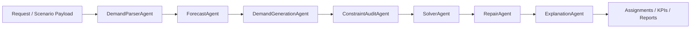

# ShortHaul Dispatch Agent

ShortHaul Dispatch Agent 是一个面向短途物流运输的调度优化服务。系统将线路需求、车队资源、运营约束和优化目标转换为可审计的调度方案，并提供 Web UI、REST API、CLI 和 Python 接口，便于接入外部运输管理系统或内部运营系统。

本工程基于 2025 MathorCup D 题延伸而来，演示案例使用的数据集为原赛题提供的数据集。对于同类短途运输调度问题，可通过替换输入数据、约束配置和目标权重复用完整求解链路。


## 功能概览

- 多 Agent 调度工作流：需求解析、预测、任务生成、约束审计、求解器调用、异常修复和方案解释。
- 可验证优化后端：优先调用 OR-Tools CP-SAT，求解失败或超时时使用确定性启发式兜底。
- Web UI：支持上传单个 Excel 工作簿或高级 CSV/JSON、修改约束和目标、运行优化、查看 KPI 与调度甘特图。
- REST API：通过 `/schedule` 和 `/schedule/upload` 接口向外部系统提供调度优化能力。
- 批量实验：支持指标汇总、约束审计、敏感性分析、结果表导出和可选 W&B 实验记录。
- 工程化交付：包含单元测试、烟测、格式检查、编译检查和 GitHub Actions。

## 接口方式

| 方式 | 入口 | 用途 |
| --- | --- | --- |
| Web UI | `http://127.0.0.1:8000/` | 交互式编辑场景、运行优化、查看可视化结果 |
| REST API | `POST /schedule` / `POST /schedule/upload` | 接入外部系统或服务端流程 |
| CLI | `python -m shorthaul_agent.cli ...` | 批量实验与可复现实验 |
| Python | `DispatchOrchestrator(config).run(...)` | 在 Python 服务中直接调用调度器 |

## 快速开始

面向外部使用者的推荐流程是一张 Excel 工作簿，不需要手写 JSON：

1. 启动 Web UI。
2. 点击“下载 Excel 模板”，或直接打开 [examples/workbook_template/shorthaul_dispatch_template.xlsx](examples/workbook_template/shorthaul_dispatch_template.xlsx)。
3. 填写三张必需表：`fleets`、`routes`、`demand`。
4. 上传工作簿，按需修改车辆容量、容器容量、串点数和目标权重。
5. 点击“上传并运行”，查看 KPI、外部承运任务和调度甘特图。

CSV 和内部 JSON 入口仍然保留，但定位为系统集成、自动化导出和调试使用。

## 安装

```powershell
python -m pip install -U pip
python -m pip install -e ".[solver,api]"
```

本地源码运行时设置：

```powershell
$env:PYTHONPATH="src"
```

开发、实验和跟踪依赖：

```powershell
python -m pip install -e ".[dev,experiment,tracking]"
```

## 启动 Web UI

Windows 环境可直接运行启动脚本：

```powershell
scripts\run_web_ui_windows.cmd
```

默认使用 `base` 环境和 `D:\miniconda3\Scripts\activate.bat`。如需指定其他环境：

```powershell
$env:SHORT_HAUL_ENV="base"
scripts\run_web_ui_windows.cmd
```

如需修改端口：

```powershell
$env:SHORT_HAUL_PORT="8010"
scripts\run_web_ui_windows.cmd
```

也可以手动启动：

```powershell
$env:PYTHONPATH="src"
uvicorn shorthaul_agent.api:app --host 127.0.0.1 --port 8000
```

浏览器打开：

```text
http://127.0.0.1:8000/
```

界面提供以下能力：

1. 在右上角切换中文或 English 界面。
2. 下载 Excel 模板，将业务数据粘贴到 `fleets`、`routes`、`demand` 三张表。
3. 编辑自然语言调度需求。
4. 修改车辆容量、容器容量、最大串点数、外部承运开关和目标权重。
5. 上传工作簿并调用 `/schedule/upload` 运行优化。
6. 查看成本、自有车任务数、外部承运数、装载率等 KPI。
7. 查看调度甘特图和完整 JSON 响应。

## 准备完整案例数据包

本地存在完整案例数据时，可以先导出一份与 UI/API 对齐的上传数据包：

```powershell
$env:PYTHONPATH="src"
python scripts/export_d_problem_upload_package.py --data-dir D题 --output-dir outputs_d_problem_upload_package
```

也可以使用 CLI 入口：

```powershell
$env:PYTHONPATH="src"
python -m shorthaul_agent.cli export-d-upload-package --data-dir D题 --output-dir outputs_d_problem_upload_package
```

完整案例数据包会生成推荐的 Excel 工作簿，同时保留 CSV 和 JSON，适合复现实验、UI 演示和系统调试。普通外部使用者优先使用单个 Excel 工作簿。

可点击查看或下载模板：

- 人类可读接入教程：`GET /contract`
- 模板预览：`GET /templates/view`
- Excel 模板下载：`GET /templates/workbook.xlsx`
- 机器可读 schema：`GET /schema`

生成目录包含：

- `shorthaul_dispatch_workbook.xlsx`：推荐上传文件，包含 `fleets`、`routes`、`demand` 等工作表。
- `payload.json`：可直接在 Web UI 上传，或作为 `POST /schedule` 请求体。
- `fleets.csv`、`routes.csv`、`forecast.csv`：标准 CSV 上传文件。
- `milk_run_pairs.csv`：可串点站点兼容关系。
- `config_overrides.json`：容量、容器、任务生成策略和目标权重。
- `request.txt`：自然语言调度需求。
- `manifest.json`：数据规模和文件清单。

该目录默认不进入 Git，适合放置本地完整数据或生产数据的运行时副本。

## 外部数据接入

推荐把业务数据整理成一个 Excel 工作簿。最小可运行输入只需要三张表：

| 表名 | 作用 | 最少字段 |
| --- | --- | --- |
| `fleets` | 自有车队资源 | `fleet_id`, `owned_vehicles` |
| `routes` | 线路、波次、时间窗和成本 | `route_id`, `origin`, `destination`, `wave`, `latest_dispatch_time`, `travel_min`, `fleet_id` |
| `demand` | 线路货量 | `route_id`, `volume`，可选 `ready_time` |

可选表：

- `compatibility`：可以串点的目的站点对。
- `settings`：车辆容量、容器容量、最大串点数、求解策略和目标权重。

服务运行后可在浏览器中查看字段解释和样例：

```http
GET /templates/view
GET /contract
```

系统集成时，把同一个工作簿作为 multipart 文件上传即可：

```http
POST /schedule/upload
Content-Type: multipart/form-data
```

字段名使用 `workbook`。

也可以在本地将工作簿转换为内部 JSON，便于排查接口对齐问题：

```powershell
$env:PYTHONPATH="src"
python -m shorthaul_agent.cli build-payload --workbook examples/workbook_template/shorthaul_dispatch_template.xlsx --request examples/external_request.txt --output outputs/schedule_payload.json
```

高级集成也可以直接构造 `/schedule` JSON payload。payload 的核心结构是 `request`、`instance.fleets`、`instance.routes`、`instance.forecast` 和 `config_overrides`。

如果既有系统已经稳定导出 CSV，也可使用 CSV 模板转换：

```powershell
$env:PYTHONPATH="src"
python -m shorthaul_agent.cli build-payload --csv-dir examples/csv_template --request examples/external_request.txt --output outputs/schedule_payload.json
```

机器可解析的接口说明：

```http
GET /schema
GET /templates
POST /validate-instance
POST /schedule/upload
POST /schedule/from-csv-dir
```

完整字段说明见 [输入契约文档](docs/input_contract.md)。

## REST API

服务启动后调用：

```http
POST /schedule
```

浏览器或表单上传调用：

```http
POST /schedule/upload
Content-Type: multipart/form-data
```

上传方式三选一，推荐第一种：

- `workbook`：单个 Excel 工作簿，包含 `fleets`、`routes`、`demand` 三张必需表。
- `payload_json`：完整 `payload.json` 文件。
- `fleets`、`routes`、`forecast`：三个必需 CSV 文件；可选 `milk_run_pairs` 和 `config_overrides`。

请求体结构：

```json
{
  "request": "Schedule 2024-12-16 short-haul operations. Minimize cost, allow containers, and improve owned-vehicle turnover.",
  "prefer_cpsat": true,
  "config_overrides": {
    "vehicle_capacity": 1000,
    "container_capacity": 800,
    "max_stops": 3,
    "allow_container": true,
    "allow_external": true,
    "tail_cover_strategy": "cost_aware",
    "objective_weights": {
      "cost": 1.0,
      "turnover": 0.5,
      "fill_rate": 0.2
    }
  },
  "instance": {
    "id": "sample-instance",
    "date": "2024-12-16",
    "fleets": [],
    "routes": [],
    "forecast": []
  }
}
```

完整可运行示例：

```http
GET /demo
```

响应字段：

| 字段 | 说明 |
| --- | --- |
| `solution.status` | 求解状态，例如 `FEASIBLE`、`INFEASIBLE` |
| `solution.assignments` | 调度任务明细，包含车辆、线路、发车时间、装载量、承运类型和容器标记 |
| `solution.kpis` | 成本、任务数、自有车使用、外部承运、周转率和装载率等指标 |
| `warnings` | 约束、兜底、修复或数据质量告警 |
| `explanations` | 用于报告和前端展示的结构化解释信息 |

## 输入模型

调度场景通过 `instance` 传入。

| 模块 | 内容 |
| --- | --- |
| `fleets` | 车队编号、自有车数量、固定成本、单趟成本、装卸时间 |
| `routes` | 线路编号、始发地、目的地、波次、最晚发运时间、行驶时间、所属车队、成本参数 |
| `forecast` | 按线路和时间片组织的预测货量 |
| `milk_run_pairs` | 可选串点兼容关系 |

常用配置通过 `config_overrides` 传入。

| 参数 | 说明 |
| --- | --- |
| `vehicle_capacity` | 普通车辆容量 |
| `container_capacity` | 容器容量 |
| `max_stops` | 单个组合任务允许的最大站点数 |
| `allow_container` | 是否启用容器决策 |
| `allow_external` | 是否允许外部承运兜底 |
| `tail_cover_strategy` | 尾货覆盖策略，例如 `cost_aware`、`duration_aware`、`fill_aware` |
| `tail_candidate_strategy` | 串点候选生成策略，例如 `exhaustive`、`beam` |
| `objective_weights.cost` | 成本最小化权重 |
| `objective_weights.turnover` | 自有车周转权重 |
| `objective_weights.fill_rate` | 装载率权重 |

## 批量实验

批量实验链路包含预测、任务生成、约束审计、优化求解、异常修复、报告生成和图表导出。

```powershell
$env:PYTHONPATH="src"
D:\miniconda3\python.exe -m shorthaul_agent.cli run-experiment --config experiments/d_problem_performance.yaml --data-dir BENCHMARK_DATA_DIR --output-dir outputs_performance_stage
```

主要输出：

- `result_table_1.xlsx` 至 `result_table_4.xlsx`
- `experiment_summary.json`
- `experiment_report.md`
- `constraint_audit.json` 和 `constraint_audit.md`
- `focus_routes_report.md`
- `gantt_problem2.png` 和 `gantt_problem3.png`
- `sensitivity_analysis.csv` 和 `sensitivity_analysis.xlsx`

本地数据集和实验输出默认不进入 Git。

## W&B 实验记录

安装跟踪依赖：

```powershell
python -m pip install -e ".[tracking]"
```

在线记录实验：

```powershell
$env:PYTHONPATH="src"
$env:WANDB_PROJECT="shorthaul-dispatch-agent"
$env:WANDB_MODE="online"
D:\miniconda3\python.exe -m shorthaul_agent.cli run-experiment --config experiments/d_problem_wandb_online.yaml --data-dir BENCHMARK_DATA_DIR --output-dir outputs_wandb_online
```

当 W&B 不可用时，实验仍会继续执行，并在 `experiment_summary.json` 中记录跟踪状态。

## 架构



LLM 或规则解析层负责理解调度需求并生成结构化输入；优化层负责容量、时间窗、串点兼容、外部承运和容器决策等必须被算法验证的约束。

## 目录结构

```text
.
|-- .github/workflows/ci.yml       # GitHub Actions 检查
|-- docs/                          # 架构与实验文档
|-- examples/                      # 小型公开示例
|-- experiments/                   # 可复现实验配置
|-- reports/                       # 技术报告
|-- scripts/                       # 烟测、格式检查、Web UI 启动、预览图生成
|-- src/shorthaul_agent/
|   |-- agents.py                  # 多 Agent 编排
|   |-- api.py                     # FastAPI 服务与 Web UI 入口
|   |-- web_ui.py                  # 内置浏览器界面
|   |-- experiment.py              # 批量实验链路
|   |-- tracking.py                # 可选 W&B 集成
|   |-- solvers/                   # CP-SAT、启发式和任务生成逻辑
|   `-- models.py                  # 共享数据模型
|-- tests/
|-- pyproject.toml
`-- README.md
```

## 质量检查

```powershell
python scripts/format_check.py
python -m compileall -q src tests scripts
python scripts/smoke_test.py
pytest
```

GitHub Actions 会在 `push` 和 `pull_request` 时执行同等检查。

## 文档

- [技术报告](reports/technical_report.md)
- [架构说明](docs/architecture.md)
- [实验协议](docs/experiments.md)

## 数据管理

本地数据集、实验输出、W&B 运行目录和环境变量文件不提交到版本库。生产数据或私有数据应通过运行时参数、外部存储或 API payload 提供。
