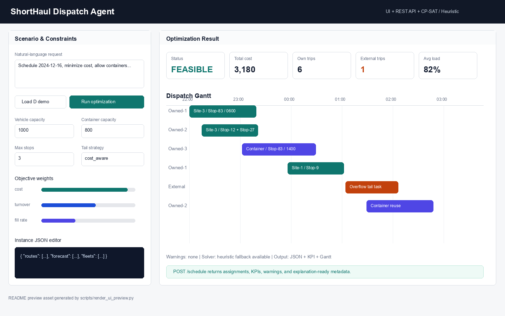
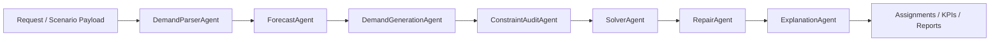

# ShortHaul Dispatch Agent

ShortHaul Dispatch Agent 是一个面向短途物流运输的调度优化服务。系统将线路需求、车队资源、运营约束和优化目标转换为可审计的调度方案，并提供 Web UI、REST API、CLI 和 Python 接口，便于接入外部运输管理系统或内部运营系统。

本工程基于 2025 MathorCup D 题延伸而来，演示案例使用的数据集为原赛题提供的数据集。对于同类短途运输调度问题，可通过替换输入数据、约束配置和目标权重复用完整求解链路。



## 功能概览

- 多 Agent 调度工作流：数据接入、需求解析、预测、任务生成、约束审计、求解器调用、异常修复和方案解释。
- 可验证优化后端：优先调用 OR-Tools CP-SAT，求解失败或超时时使用确定性启发式兜底。
- Web UI：支持上传业务系统导出的一个或多个 Excel/CSV/JSON，或粘贴表格文本，由数据接入 Agent 自动对齐模型输入，并展示阶段进度与可视化结果。
- REST API：通过 `/schedule`、`/schedule/upload` 和 `/schedule/export` 接口向外部系统提供调度优化与结果导出能力。
- 批量实验：支持指标汇总、约束审计、敏感性分析、结果表导出和可选 W&B 实验记录。
- 工程化交付：包含单元测试、烟测、格式检查、编译检查和 GitHub Actions。

## 接口方式

| 方式 | 入口 | 用途 |
| --- | --- | --- |
| Web UI | `http://127.0.0.1:8000/` | 交互式编辑场景、运行优化、查看可视化结果 |
| REST API | `POST /schedule` / `POST /schedule/upload` / `POST /schedule/export` | 接入外部系统或服务端流程 |
| CLI | `python -m shorthaul_agent.cli ...` | 批量实验与可复现实验 |
| Python | `DispatchOrchestrator(config).run(...)` | 在 Python 服务中直接调用调度器 |

## 快速开始

面向外部使用者的推荐流程是“上传数据，直接运行”，不需要先学习内部字段格式：

1. 启动 Web UI。
2. 上传业务系统导出的一个或多个 Excel/CSV/JSON，或直接粘贴表格文本。
3. 如数据字段不规整，在页面中配置数据接入 Agent 的 LLM API 供应方、Base URL、API Key 和模型名。
4. 编辑自然语言调度需求，并按需修改车辆容量、容器容量、串点数和目标权重。
5. 点击“上传并运行”，Agent 会自动识别字段、对齐内部调度输入，并调用优化器。
6. 查看 KPI、外部承运任务和调度甘特图。
7. 在“导出结果”区域选择需要的文件，一键下载包含调度明细、KPI 和完整响应的 zip 包。

已规整的数据会优先走本地确定性解析；只有字段无法自动识别时才调用用户配置的 LLM API。
如果用户已经准备了专门微调的数据接入模型，只需要把模型名填入页面的 `data_agent_model`，或设置 `SHORT_HAUL_INGESTION_MODEL`。

数据接入 Agent 不绑定 OpenAI 官方服务。底层使用 OpenAI-compatible Chat Completions 客户端，只要第三方供应方提供兼容 endpoint，就可以在 UI 中选择“第三方兼容 / 自定义”，填写该供应方的 Base URL、API Key 和模型名。

### LLM 供应方建议

数据表对齐任务更依赖结构化输出、跨表字段理解和稳定 JSON 生成，不一定需要最贵的通用推理模型。建议按下面顺序试用：

| 使用场景 | 推荐选择 | 说明 |
| --- | --- | --- |
| 常见中文业务表、字段名相对清楚 | DeepSeek `deepseek-v4-flash` | 成本较低，速度快，中文字段理解较稳，适合作为默认首选。 |
| 阿里云/DashScope 环境或表格字段较规整 | 通义千问 `qwen3.6-flash` | OpenAI-compatible endpoint 易接入，Flash 型号更适合低延迟字段对齐。 |
| Google Gemini API 或 OpenRouter | `gemini-2.5-flash` / `google/gemini-2.5-flash` | 适合需要 Flash 风格低延迟和较强表格理解的接入场景。 |
| 表格特别乱、备注很多、跨文件关系复杂 | Flash/fast 预设 + 本机基准复测 | 优先关注 JSON 稳定性、长上下文能力和实际端到端通过率，而不是只看推理榜单。 |
| 企业已有内网/微调模型 | 自定义 OpenAI-compatible endpoint | 只要兼容 Chat Completions，就可以直接填 Base URL、Key 和模型名。 |

项目提供了可复测脚本，不把推荐写死。它会读取环境变量中的供应商 API Key，使用 `examples/messy_upload/` 中的杂乱业务表测试“字段对齐 → 实例校验 → 快速求解”完整链路：

```powershell
$env:PYTHONPATH="src"
python scripts/benchmark_llm_ingestion.py --sample-dir examples/messy_upload --output-dir outputs_llm_ingestion_benchmark
```

默认会自动识别 `DEEPSEEK_API_KEY`、`DASHSCOPE_API_KEY`、`OPENAI_API_KEY`、`MOONSHOT_API_KEY`、`ZHIPU_API_KEY`、`OPENROUTER_API_KEY` 等环境变量，并输出：

- `outputs_llm_ingestion_benchmark/llm_ingestion_benchmark.json`
- `outputs_llm_ingestion_benchmark/llm_ingestion_benchmark.md`

当前推荐配置：DeepSeek `deepseek-v4-flash`、通义千问 `qwen3.6-flash`、Gemini `gemini-2.5-flash` 和智谱 `glm-4.7-flash` 都作为 Flash/fast 首批候选；OpenRouter 默认使用 `google/gemini-2.5-flash`。OpenAI 官方当前保留 `gpt-4.1-mini` 作为低延迟默认，Kimi 入口使用 `kimi-k2-turbo-preview` 作为高速候选。建议继续用脚本在自己的 API Key 和真实数据上复测。

也可以用环境变量配置数据接入 Agent：

```powershell
$env:SHORT_HAUL_INGESTION_PROVIDER="openai_compatible"
$env:SHORT_HAUL_INGESTION_API_KEY="sk-..."
$env:SHORT_HAUL_INGESTION_BASE_URL="https://your-provider.example/v1"
$env:SHORT_HAUL_INGESTION_MODEL="your-ingestion-model"
$env:SHORT_HAUL_INGESTION_TIMEOUT_SECONDS="120"
```

## 安装

```powershell
python -m pip install -U pip
python -m pip install -e ".[solver,api]"
```

本地源码运行时设置：

```powershell
$env:PYTHONPATH="src"
```

开发、实验和跟踪依赖：

```powershell
python -m pip install -e ".[dev,experiment,tracking]"
```

`llm` extra 会额外安装 OpenAI Python SDK；未安装时，数据接入 Agent 会自动使用内置 HTTP 客户端调用兼容的 Chat Completions 接口。

## 启动 Web UI

Windows 环境可直接运行启动脚本：

```powershell
scripts\run_web_ui_windows.cmd
```

默认使用 `base` 环境和 `D:\miniconda3\Scripts\activate.bat`。如需指定其他环境：

```powershell
$env:SHORT_HAUL_ENV="base"
scripts\run_web_ui_windows.cmd
```

如需修改端口：

```powershell
$env:SHORT_HAUL_PORT="8010"
scripts\run_web_ui_windows.cmd
```

也可以手动启动：

```powershell
$env:PYTHONPATH="src"
uvicorn shorthaul_agent.api:app --host 127.0.0.1 --port 8000
```

浏览器打开：

```text
http://127.0.0.1:8000/
```

界面提供以下能力：

1. 在右上角切换中文或 English 界面。
2. 上传一个或多个业务数据文件，或粘贴表格文本。
3. 编辑自然语言调度需求。
4. 从供应商预设中选择 DeepSeek、通义千问、Gemini、OpenAI、Kimi、GLM、OpenRouter 或自定义 endpoint。
5. 修改车辆容量、容器容量、最大串点数、外部承运开关和目标权重。
6. 通过阶段条查看当前进度：准备请求、Router 判别、字段对齐、约束校验、优化求解、渲染结果。
7. 查看成本、自有车任务数、外部承运数、装载率等 KPI。
8. 查看调度甘特图和完整 JSON 响应。
9. 多选导出完整结果 JSON、调度明细 CSV、KPI JSON、接入元数据和告警文件。

Web UI 的上传运行使用后台任务接口 `/schedule/upload/jobs`，页面会轮询真实服务端阶段状态；不再依赖前端估计进度。导出的 `assignments.csv` 使用 UTF-8 BOM，直接用 Windows Excel 或 WPS 打开时中文不应乱码。

## 准备完整案例数据包

本地存在完整案例数据时，可以先导出一份与 UI/API 对齐的上传数据包：

```powershell
$env:PYTHONPATH="src"
python scripts/export_d_problem_upload_package.py --data-dir BENCHMARK_DATA_DIR --output-dir outputs_benchmark_upload_package
```

也可以使用 CLI 入口：

```powershell
$env:PYTHONPATH="src"
python -m shorthaul_agent.cli export-d-upload-package --data-dir BENCHMARK_DATA_DIR --output-dir outputs_benchmark_upload_package
```

完整案例数据包会生成 Excel、CSV 和 JSON，适合复现实验、UI 演示和系统调试。普通外部使用者可以直接上传 Excel 工作簿；开发者也可以用 CSV/JSON 做接口调试。

生成目录包含：

- `shorthaul_dispatch_workbook.xlsx`：推荐上传文件，包含 `fleets`、`routes`、`demand` 等工作表。
- `payload.json`：可直接在 Web UI 上传，或作为 `POST /schedule` 请求体。
- `fleets.csv`、`routes.csv`、`forecast.csv`：标准 CSV 上传文件。
- `milk_run_pairs.csv`：可串点站点兼容关系。
- `config_overrides.json`：容量、容器、任务生成策略和目标权重。
- `request.txt`：自然语言调度需求。
- `manifest.json`：数据规模和文件清单。

该目录默认不进入 Git，适合放置本地完整数据或生产数据的运行时副本。

## 数据接入 Agent

数据接入 Agent 负责把外部业务数据转换为调度器可验证的结构化输入。上传后会先经过 Router 判别，不要求用户自己判断数据是否结构化：

- 标准 payload：检测到完整 `payload.json` 时直接运行。
- 标准接口表：检测到 `fleets.csv`、`routes.csv`、`forecast.csv` 或标准工作簿时本地解析。
- 原始结构化附件：检测到线路、历史 10 分钟货量、日度预知货量、串点关系、车队数量等列集合时，本地生成预测与调度输入，不调用 LLM。
- LLM 对齐：只有前面规则都不匹配时，才调用用户配置的 OpenAI-compatible / Chat Completions-compatible API。

用户可以接入自己的微调数据接入模型；系统只需要一个兼容 Chat Completions 的 API 地址、Key 和模型名。生产部署时建议通过环境变量配置密钥，Web UI 中填写的密钥仅随本次上传请求提交给当前服务端。

系统集成时，直接把业务文件作为 multipart 文件上传：

```http
POST /schedule/upload
Content-Type: multipart/form-data
```

常用表单字段：

| 字段 | 说明 |
| --- | --- |
| `data_file` | 业务数据文件，支持 Excel/CSV/JSON/TXT；可在同一个 multipart 请求中重复传入多个文件 |
| `raw_data_text` | 粘贴的表格文本、CSV、JSON 或导出片段 |
| `request` | 自然语言调度需求 |
| `use_data_agent` | 设置为 `true` 时启用数据接入 Agent |
| `data_agent_provider` | 可选，`openai_compatible` 或 `openai`，用于记录供应方类型 |
| `data_agent_api_key` | 可选，留空时读取环境变量 |
| `data_agent_base_url` | 可选，第三方 OpenAI-compatible / Chat Completions-compatible endpoint |
| `data_agent_model` | 可选，供应方侧模型名；留空时使用环境变量或默认值 |
| `data_agent_timeout_seconds` | 可选，数据接入 Agent 调用 LLM 的超时时间，默认 60 秒 |
| `config_overrides_json` | 显式约束与目标设置，优先级高于自然语言和数据文件 |

开发者仍可使用标准 payload、模板和 schema 做自动化测试，见 [输入契约文档](docs/input_contract.md)。

## REST API

服务启动后调用：

```http
POST /schedule
```

浏览器或表单上传调用：

```http
POST /schedule/upload
Content-Type: multipart/form-data
```

结果导出调用：

```http
POST /schedule/export
Content-Type: application/json
```

请求体中的 `result` 使用 `/schedule` 或 `/schedule/upload` 返回的完整 JSON，`files` 可多选：

```json
{
  "result": {"solution": "..."},
  "files": ["solution_json", "assignments_csv", "kpis_json", "upload_meta_json", "warnings_txt"]
}
```

`assignments_csv` 会写入 `assignments.csv`，编码为 UTF-8 with BOM，便于 Windows Excel 直接打开。

推荐上传方式：

- `data_file`：业务数据文件，由数据接入 Agent 自动识别；同一个字段可重复传入多个文件。
- `raw_data_text`：粘贴表格文本或导出片段，由数据接入 Agent 自动转换。

开发调试方式：

- `payload_json`：完整标准 payload。
- `workbook`：已经对齐的标准工作簿。
- `fleets`、`routes`、`forecast`：标准 CSV 文件组。

请求体结构：

```json
{
  "request": "Schedule 2024-12-16 short-haul operations. Minimize cost, allow containers, and improve owned-vehicle turnover.",
  "prefer_cpsat": true,
  "config_overrides": {
    "vehicle_capacity": 1000,
    "container_capacity": 800,
    "max_stops": 3,
    "allow_container": true,
    "allow_external": true,
    "tail_cover_strategy": "cost_aware",
    "objective_weights": {
      "cost": 1.0,
      "turnover": 0.5,
      "fill_rate": 0.2
    }
  },
  "instance": {
    "id": "sample-instance",
    "date": "2024-12-16",
    "fleets": [],
    "routes": [],
    "forecast": []
  }
}
```

完整可运行示例：

```http
GET /demo
```

响应字段：

| 字段 | 说明 |
| --- | --- |
| `solution.status` | 求解状态，例如 `FEASIBLE`、`INFEASIBLE` |
| `solution.assignments` | 调度任务明细，包含车辆、线路、发车时间、装载量、承运类型和容器标记 |
| `solution.kpis` | 成本、任务数、自有车使用、外部承运、周转率和装载率等指标 |
| `warnings` | 约束、兜底、修复或数据质量告警 |
| `explanations` | 用于报告和前端展示的结构化解释信息 |

## 开发者接口模型（可选）

业务使用者通常不需要手写下面的结构；数据接入 Agent 会根据上传文件或粘贴数据自动生成。该结构主要用于服务端集成、自动化测试和二次开发。

调度场景通过 `instance` 传入。

| 模块 | 内容 |
| --- | --- |
| `fleets` | 车队编号、自有车数量、固定成本、单趟成本、装卸时间 |
| `routes` | 线路编号、始发地、目的地、波次、最晚发运时间、行驶时间、所属车队、成本参数 |
| `forecast` | 按线路和时间片组织的预测货量 |
| `milk_run_pairs` | 可选串点兼容关系 |

常用配置通过 `config_overrides` 传入。

| 参数 | 说明 |
| --- | --- |
| `vehicle_capacity` | 普通车辆容量 |
| `container_capacity` | 容器容量 |
| `max_stops` | 单个组合任务允许的最大站点数 |
| `allow_container` | 是否启用容器决策 |
| `allow_external` | 是否允许外部承运兜底 |
| `tail_cover_strategy` | 尾货覆盖策略，例如 `cost_aware`、`duration_aware`、`fill_aware` |
| `tail_candidate_strategy` | 串点候选生成策略，例如 `exhaustive`、`beam` |
| `objective_weights.cost` | 成本最小化权重 |
| `objective_weights.turnover` | 自有车周转权重 |
| `objective_weights.fill_rate` | 装载率权重 |

## 批量实验

批量实验链路包含预测、任务生成、约束审计、优化求解、异常修复、报告生成和图表导出。

```powershell
$env:PYTHONPATH="src"
D:\miniconda3\python.exe -m shorthaul_agent.cli run-experiment --config experiments/d_problem_performance.yaml --data-dir BENCHMARK_DATA_DIR --output-dir outputs_performance_stage
```

主要输出：

- `result_table_1.xlsx` 至 `result_table_4.xlsx`
- `experiment_summary.json`
- `experiment_report.md`
- `constraint_audit.json` 和 `constraint_audit.md`
- `focus_routes_report.md`
- `gantt_problem2.png` 和 `gantt_problem3.png`
- `sensitivity_analysis.csv` 和 `sensitivity_analysis.xlsx`

本地数据集和实验输出默认不进入 Git。

## W&B 实验记录

安装跟踪依赖：

```powershell
python -m pip install -e ".[tracking]"
```

在线记录实验：

```powershell
$env:PYTHONPATH="src"
$env:WANDB_PROJECT="shorthaul-dispatch-agent"
$env:WANDB_MODE="online"
D:\miniconda3\python.exe -m shorthaul_agent.cli run-experiment --config experiments/d_problem_wandb_online.yaml --data-dir BENCHMARK_DATA_DIR --output-dir outputs_wandb_online
```

当 W&B 不可用时，实验仍会继续执行，并在 `experiment_summary.json` 中记录跟踪状态。

## 架构



LLM 或规则解析层负责理解调度需求并生成结构化输入；优化层负责容量、时间窗、串点兼容、外部承运和容器决策等必须被算法验证的约束。

## 目录结构

```text
.
|-- .github/workflows/ci.yml       # GitHub Actions 检查
|-- docs/                          # 架构与实验文档
|-- examples/                      # 小型公开示例
|-- experiments/                   # 可复现实验配置
|-- reports/                       # 技术报告
|-- scripts/                       # 烟测、格式检查、Web UI 启动、预览图生成
|-- src/shorthaul_agent/
|   |-- agents.py                  # 多 Agent 编排
|   |-- data_ingestion_agent.py    # 用户数据接入 Agent
|   |-- api.py                     # FastAPI 服务与 Web UI 入口
|   |-- web_ui.py                  # 内置浏览器界面
|   |-- experiment.py              # 批量实验链路
|   |-- tracking.py                # 可选 W&B 集成
|   |-- solvers/                   # CP-SAT、启发式和任务生成逻辑
|   `-- models.py                  # 共享数据模型
|-- tests/
|-- pyproject.toml
`-- README.md
```

## 质量检查

```powershell
python scripts/format_check.py
python -m compileall -q src tests scripts
python scripts/smoke_test.py
pytest
```

GitHub Actions 会在 `push` 和 `pull_request` 时执行同等检查。

## 文档

- [技术报告](reports/technical_report.md)
- [架构说明](docs/architecture.md)
- [实验协议](docs/experiments.md)

## 数据管理

本地数据集、实验输出、W&B 运行目录和环境变量文件不提交到版本库。生产数据或私有数据应通过运行时参数、外部存储或 API payload 提供。
