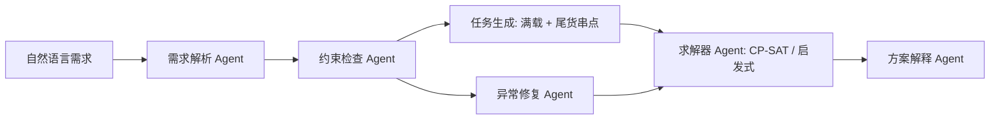

# 短途运输多智能体调度 Agent

本项目将数学建模论文《基于混合预测与约束规划的短途运输集成调度优化研究》工程化为一个 **LLM + 约束规划** 的短途运输调度 Agent。

核心分工：

- LLM/规则解析：理解自然语言调度需求，抽取日期、目标线路、容量、容器、优化偏好等结构化约束。
- 约束检查：校验线路、车队、预测货量、时间窗、容量和串点规则。
- 任务生成：将 10 分钟粒度货量转成满载任务与尾货任务，并对尾货做串点合并。
- 求解器调用：优先使用 OR-Tools CP-SAT；若环境未安装 OR-Tools，则自动使用确定性启发式兜底。
- 方案解释：输出成本、周转率、装载率、外部承运数，以及重点线路的发运方案。
- 异常修复：为不可行输入或运力不足提供放松建议与兜底策略。

## 当前状态

已经完成一个可运行的 MVP：

- `src/shorthaul_agent/`：核心 Python 包
- `examples/sample_instance.json`：论文场景简化样例
- `examples/sample_request.txt`：中文自然语言调度需求
- `reports/technical_report.md`：技术报告初稿
- `scripts/smoke_test.py`：端到端烟测

当前工作区没有安装 OR-Tools，样例会自动走启发式求解。安装 `.[solver]` 后会优先调用 CP-SAT。

## 快速运行

```powershell
$env:PYTHONPATH="src"
python -m shorthaul_agent.cli --instance examples/sample_instance.json --request examples/sample_request.txt --output examples/sample_solution.json
```

或运行烟测：

```powershell
python scripts/smoke_test.py
```

推荐的完整开发安装：

```powershell
python -m venv .venv
.\.venv\Scripts\Activate.ps1
pip install -e ".[solver,llm,dev]"
```

启用 LLM 解析：

```powershell
$env:OPENAI_API_KEY="你的 API Key"
$env:SHORT_HAUL_LLM_MODEL="你的模型名"
```

没有 API Key 时，系统使用内置规则解析器，仍可完成样例调度。

## 真实 D 题实验

数据集放在 `D题/` 后，可以直接运行第一批复现实验：

```powershell
$env:PYTHONPATH="src"
D:\miniconda3\python.exe -m shorthaul_agent.cli run-experiment --data-dir D题 --output-dir outputs
```

当前已跑通一版真实数据实验，输出位于 `outputs/`：

- `result_table_1.xlsx`
- `result_table_2.xlsx`
- `result_table_3.xlsx`
- `result_table_4.xlsx`
- `experiment_summary.json`
- `experiment_report.md`
- `sensitivity_analysis.csv`
- `sensitivity_analysis.xlsx`
- `focus_routes_report.md`
- `gantt_problem2.png`
- `gantt_problem3.png`
- `sensitivity_on_time.png`

实验使用可解释统计预测基线：日度预测采用“预知货量 × 历史校正因子”，10 分钟拆解采用历史到达比例。调度阶段优先调用 OR-Tools CP-SAT，失败时自动启发式兜底。

实验链路还包含问题 4 的固定方案敏感性分析：在问题 3 调度方案不重新优化的前提下，模拟总量偏差 `-30%/-10%/+10%/+30%` 与时间漂移 `-60/-30/+30/+60/+90` 分钟，输出滞留量、按时装载率、自有车周转率和车辆均包裹变化。

问题 3 额外加入非退化保护：标准容器是可选技术，因此问题 2 的可行调度可以转换为问题 3 的无退化基线；若 CP-SAT 在限定时间内给出的容器方案成本更高，系统会采用该基线并对小于 800 件的自有车任务标记可使用容器。

本机 Codex 进程创建新 conda 环境时被 conda 包缓存写权限拦截；但 `D:\miniconda3\python.exe` 的 base 环境已包含 `pandas/numpy/openpyxl/ortools`，因此当前真实实验先基于 base Python 完成。手动终端创建环境时建议：

```powershell
$env:CONDA_OVERRIDE_CUDA='0'
conda create -n shorthaul-agent-exp python=3.11 -y
conda activate shorthaul-agent-exp
python -m pip install -U pip
python -m pip install -e ".[solver,llm,api,dev,experiment]"
```

## API 服务

安装 `api` extra 后可启动 FastAPI 服务：

```powershell
$env:PYTHONPATH="src"
uvicorn shorthaul_agent.api:app --host 127.0.0.1 --port 8000
```

主要接口：

- `GET /health`
- `POST /schedule`：传入自然语言需求和结构化实例 JSON，返回 Agent 调度结果
- `POST /experiments/d-problem`：触发 D 题真实数据实验

## 质量检查

本仓库已配置 GitHub Actions：`.github/workflows/ci.yml`。每次 push / pull request 会运行：

- `python scripts/format_check.py`
- `python -m compileall -q src`
- `python scripts/smoke_test.py`
- `pytest`

本地可先运行：

```powershell
$env:PYTHONPATH="src"
D:\miniconda3\python.exe scripts\format_check.py
D:\miniconda3\python.exe -m compileall -q src tests scripts
D:\miniconda3\python.exe scripts\smoke_test.py
```

## 项目结构

```text
.
├── MC25002885-D.pdf                  # 原数学建模论文
├── README.md
├── pyproject.toml
├── examples/
│   ├── sample_instance.json
│   └── sample_request.txt
├── reports/
│   └── technical_report.md
├── scripts/
│   └── smoke_test.py
├── src/shorthaul_agent/
│   ├── agents.py
│   ├── cli.py
│   ├── io.py
│   ├── models.py
│   ├── parsing.py
│   ├── validation.py
│   └── solvers/
│       ├── cpsat.py
│       ├── heuristic.py
│       └── task_generation.py
└── tests/
    └── test_pipeline.py
```

## Agent 流程



## 路线完成情况

1. 已接入真实附件数据，并生成结果表 1-4 的 `outputs/` 副本。
2. 已完善 CP-SAT 调度模型，覆盖外部成本、车队归属、串点成本、跨日分钟轴和容器非退化基线。
3. 已增加鲁棒性仿真，覆盖总量偏差与时间漂移场景。
4. 已增加 FastAPI 服务、调度结果导出、甘特图和重点线路解释报告。
5. 已整理 GitHub Actions，运行格式检查、包编译、烟测和单元测试。
