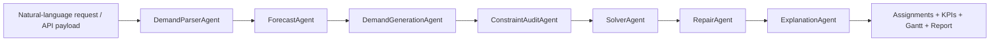

# ShortHaul Dispatch Agent

把一组短途运输约束、自然语言调度需求和优化目标，转换成可验证、可解释、可外部接入的最优化调度结果。

这个仓库现在不再只是一个数模 D 题复现实验脚本，而是一个可以直接运行的 **LLM + 多 Agent + OR-Tools CP-SAT / 启发式求解器** 调度服务。D 题数据被保留为一个完整案例模板；遇到相同或类似场景时，你只需要替换线路、货量、车辆、约束和优化目标，就可以生成新的调度方案。


## 适合什么场景

- 短途运输、城配、支线运输、站点间转运等多线路调度。
- 需要同时处理车辆容量、发运时间窗、串点可行性、自有车周转、外部车兜底、容器使用等约束的问题。
- 希望把“业务人员提出的自然语言需求”转成结构化调度请求，再交给可验证优化器求解的系统。
- 需要对每次调度输出 KPI、任务明细、异常警告、可视化甘特图和实验记录。

## 你可以怎么用

| 使用方式 | 入口 | 适用人群 |
| --- | --- | --- |
| Web UI | `http://127.0.0.1:8000/` | 想快速演示、修改约束、查看可视化结果 |
| REST API | `POST /schedule` | 想把调度能力接入外部系统 |
| CLI | `python -m shorthaul_agent.cli ...` | 想批量跑实验或复现 D 题 |
| Python SDK | `DispatchOrchestrator(config).run(...)` | 想在自己的代码里组合 Agent 和求解器 |
| D 题案例 | `experiments/d_problem_performance.yaml` | 想查看完整真实数据实验链路 |

## 快速启动 Web UI

```powershell
python -m pip install -U pip
python -m pip install -e ".[solver,api]"
$env:PYTHONPATH="src"
uvicorn shorthaul_agent.api:app --host 127.0.0.1 --port 8000
```

打开：

```text
http://127.0.0.1:8000/
```

进入页面后可以直接：

1. 点击 **Load D-problem demo** 载入内置公开示例。
2. 修改自然语言需求、容量、容器、最大串点数、尾货策略和目标权重。
3. 点击 **Run optimization** 调用 `/schedule`。
4. 查看总成本、自有车任务数、外部车任务数、平均装载率和调度甘特图。
5. 在 Raw JSON 中查看可供外部系统消费的完整结构化结果。

内置 UI 示例不依赖私有 D 题数据，因此仓库克隆后即可演示。

## REST API 接入

启动服务后，调用：

```http
POST /schedule
```

请求体由四部分组成：

```json
{
  "request": "Schedule 2024-12-16, minimize total cost, allow containers, and focus on Site-3 - Stop-83 routes.",
  "prefer_cpsat": true,
  "config_overrides": {
    "vehicle_capacity": 1000,
    "container_capacity": 800,
    "max_stops": 3,
    "allow_container": true,
    "allow_external": true,
    "tail_cover_strategy": "cost_aware",
    "objective_weights": {
      "cost": 1.0,
      "turnover": 0.5,
      "fill_rate": 0.2
    }
  },
  "instance": {
    "id": "shorthaul-demo",
    "date": "2024-12-16",
    "fleets": [],
    "routes": [],
    "forecast": []
  }
}
```

完整可运行 payload 可直接从接口读取：

```http
GET /demo
```

返回结果包含：

- `solution.assignments`：每个任务的车辆、线路、时间、装载、是否外部承运、是否使用容器。
- `solution.kpis`：总成本、任务数、自有车使用、外部承运、周转率、装载率等。
- `warnings`：容量、时间窗、串点、求解器兜底或修复信息。
- `explanations`：重点线路和策略解释所需的结构化上下文。

## 如何改约束和目标

常用参数通过 `config_overrides` 修改：

| 参数 | 含义 |
| --- | --- |
| `vehicle_capacity` | 普通车辆容量 |
| `container_capacity` | 容器容量 |
| `max_stops` | 单车最多串点数量 |
| `allow_container` | 是否允许容器方案 |
| `allow_external` | 是否允许外部承运兜底 |
| `tail_cover_strategy` | 尾货任务生成策略，如 `cost_aware`、`duration_aware`、`fill_aware` |
| `tail_candidate_strategy` | 串点候选生成策略，如 `exhaustive`、`beam` |
| `objective_weights.cost` | 成本目标权重 |
| `objective_weights.turnover` | 自有车周转目标权重 |
| `objective_weights.fill_rate` | 装载率目标权重 |

实例数据通过 `instance` 修改：

- `fleets`：车队、自有车数量、固定成本、装卸时间。
- `routes`：线路、始发地、目的地、波次、最晚发运时间、行驶时间、所属车队、外部车成本倍率。
- `forecast`：每条线路在每个时间片的预测货量。
- `milk_run_pairs`：可串点关系，如果你的场景有站点图约束，可以显式传入。

## D 题作为案例模板

真实 D 题数据和输出不进入 Git。你可以把本地数据放到 `D_PROBLEM_DATA`，然后运行：

```powershell
$env:PYTHONPATH="src"
D:\miniconda3\python.exe -m shorthaul_agent.cli run-experiment --config experiments/d_problem_performance.yaml --data-dir D_PROBLEM_DATA --output-dir outputs_performance_stage
```

主要输出：

- `result_table_1.xlsx` 到 `result_table_4.xlsx`
- `experiment_summary.json`
- `experiment_report.md`
- `constraint_audit.json` / `constraint_audit.md`
- `focus_routes_report.md`
- `gantt_problem2.png` / `gantt_problem3.png`
- `sensitivity_analysis.csv` / `sensitivity_analysis.xlsx`

这条链路展示了如何把“一堆约束”封装成可重复实验：数据适配、预测、任务生成、约束审计、求解、修复、解释和报告导出。

## 多 Agent 工作流



核心思想是让 LLM 或规则解析层负责理解需求、抽取约束和生成结构化任务，让 CP-SAT / 启发式算法负责可验证求解。这样系统既能接业务语言，又不会把关键约束交给不可验证的文本生成。

## 项目结构

```text
.
|-- .github/workflows/ci.yml       # GitHub Actions: format, compile, smoke, pytest
|-- docs/                          # 架构、实验说明、README 图片资产
|-- examples/                      # 小型公开 JSON/text 示例
|-- experiments/                   # 可复现实验配置
|-- reports/                       # 技术报告
|-- scripts/                       # 烟测、格式检查、README UI 预览图生成
|-- src/shorthaul_agent/
|   |-- agents.py                  # 多 Agent 编排
|   |-- api.py                     # FastAPI + Web UI 入口
|   |-- web_ui.py                  # 内置浏览器界面
|   |-- experiment.py              # D 题实验链路
|   |-- tracking.py                # 可选 W&B 记录
|   |-- solvers/                   # CP-SAT、启发式、任务生成
|   `-- models.py                  # 数据结构
|-- tests/
|-- pyproject.toml
`-- README.md
```

## 实验记录与 W&B

安装可选依赖：

```powershell
python -m pip install -e ".[tracking]"
```

在线记录：

```powershell
$env:PYTHONPATH="src"
$env:WANDB_PROJECT="shorthaul-dispatch-agent"
$env:WANDB_MODE="online"
D:\miniconda3\python.exe -m shorthaul_agent.cli run-experiment --config experiments/d_problem_wandb_online.yaml --data-dir D_PROBLEM_DATA --output-dir outputs_wandb_online
```

如果 W&B 不可用，实验仍会完成，跳过原因会写入 `experiment_summary.json`。

## 技术报告

主 README 面向使用和接入。更完整的学术化说明、模型假设、实验指标、复现程度和多 Agent 架构设计见：

- [工程技术报告](reports/technical_report.md)
- [架构说明](docs/architecture.md)
- [实验协议](docs/experiments.md)

## 当前基准状态

该项目是工程复现与系统化增强，不声称完全等同于原论文实现。当前验证过的性能实验中，多 Agent 求解链路相较早期 legacy pipeline 已降低问题 2/3 成本，并保留论文参考值作为 benchmark。详细数值以最新 `outputs*/experiment_summary.json` 和技术报告为准。

## CI 与质量检查

```powershell
python scripts/format_check.py
python -m compileall -q src tests scripts
python scripts/smoke_test.py
pytest
```

GitHub Actions 会在 `push` 和 `pull_request` 时运行格式检查、编译、烟测和单元测试。

## 数据与提交规范

- `D题/`、`D_PROBLEM_DATA/`、`outputs*/`、`wandb/`、`.env` 等本地数据与实验输出不提交。
- README 中的 UI 预览图是公开演示资产，可以提交。
- 技术报告保留在 `reports/`，主 README 只保留最短使用路径和外部接入说明。
