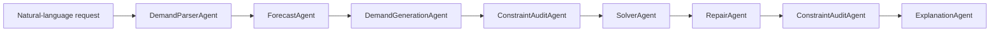
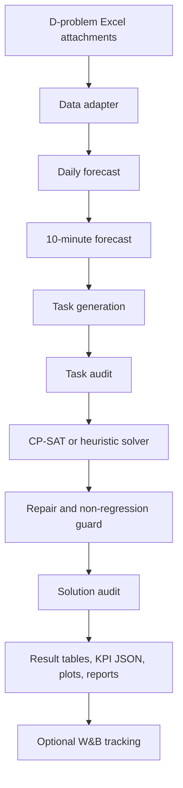

# Architecture

This project separates language understanding, constraint construction, optimization, repair, and explanation. The LLM-facing layer produces structured scheduling requests; the solver layer remains deterministic and auditable.

## Workflow

## Agent Responsibilities

| Agent | Responsibility | Key Output |
| --- | --- | --- |
| `DemandParserAgent` | Parse natural-language requests into structured constraints. | `StructuredDispatchRequest` |
| `ForecastAgent` | Build daily and 10-minute demand forecasts. | forecast tables |
| `DemandGenerationAgent` | Generate full-load tasks, tail-load tasks, and milk-run candidates. | dispatch task list |
| `ConstraintAuditAgent` | Validate capacity, time windows, milk-run compatibility, container rules, and vehicle overlap. | audit JSON and status |
| `SolverAgent` | Run CP-SAT, deterministic heuristic fallback, and seed portfolio selection. | `ScheduleSolution` |
| `RepairAgent` | Repair infeasible or weak solutions, reduce external carriers, and protect problem-3 non-regression behavior. | repaired `ScheduleSolution` |
| `ExplanationAgent` | Produce KPI summaries, focus-route explanations, and report sections. | summary JSON and Markdown report |

## Solver Design

The solver stack has three layers:

- CP-SAT portfolio: multiple search seeds can be run with deterministic worker settings; the best feasible schedule by measured KPI cost is selected.
- Heuristic fallback: used when CP-SAT is disabled, unavailable, or fails to return a feasible schedule in time.
- External-carrier repair: post-processes feasible schedules by swapping high-saving external tasks into owned vehicles and relocating blocker tasks when possible.

Problem 3 adds container decisions with these rules:

- Container capacity is `800`.
- Loading and unloading add `10 + 10` minutes.
- External carriers cannot use containers.
- A non-regression baseline prevents the container solution from silently becoming worse than the problem-2 baseline.

## Data Flow

## Reproduction Boundary

The current system is an engineering reproduction baseline. It uses the official data shape and result-table workflow, but it does not claim exact equivalence to the original paper model. Paper KPIs are kept as benchmark rows so each architecture or optimization change can be measured against the same reference.

## Output Contract

Every full D-problem run should produce:

- Result tables 1 to 4.
- `experiment_summary.json` with experiment config, data stats, KPI metrics, audit status, agent trace, sensitivity summary, and optional tracking status.
- `constraint_audit.json` and `constraint_audit.md`.
- Sensitivity CSV/XLSX.
- Focus-route report.
- Gantt and sensitivity plots when plotting dependencies are installed.

