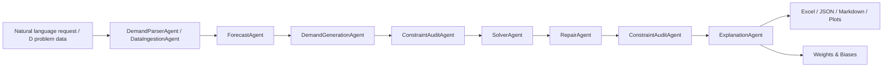

# 短途运输多智能体调度 Agent 技术报告

版本：v0.1 工程基线版
日期：2026-05-01
项目：ShortHaul-Dispatch-Agent
技术路线：LLM + Multi-Agent + OR-Tools CP-SAT + Heuristic Repair + W&B Tracking

## 1. 摘要

本项目将数学建模比赛论文中的短途运输调度方案，工程化升级为一个可运行、可复现、可审计、可持续迭代的多智能体调度系统。系统的核心思想是将自然语言理解和任务编排交给 LLM/Agent 层，将必须可验证的容量约束、时间窗约束、车辆周转约束、串点约束和成本优化交给 OR-Tools CP-SAT 与确定性启发式算法。

当前版本已完成真实 D 题数据接入、结果表 1-4 导出、CP-SAT 调度、启发式兜底、外部承运修复、问题 3 容器方案、问题 4 敏感性分析、baseline comparison、任务生成策略调参、FastAPI 展示接口、GitHub Actions CI、W&B 在线实验记录和工程化文档。当前系统不声明“论文精确复现”，而是一个工程复现基线和多智能体优化基线；论文指标作为 benchmark，用来度量后续模型与架构改进是否有效。

最新在线实验结果显示，当前多智能体方案在 baseline comparison 中取得：

| 指标 | 问题 2 | 问题 3 |
| --- | ---: | ---: |
| 当前多智能体成本 | 67701 | 67537 |
| 当前自有车周转率 | 3.1727 | 3.1818 |
| 当前外部承运任务数 | 227 | 226 |
| 论文参考成本 | 56776 | 47106 |
| 论文参考周转率 | 2.49 | 2.62 |
| 相比旧工程链路成本变化 | -4105 | -4269 |
| 相比启发式链路成本变化 | -1876 | -2040 |

任务生成策略 sweep 中，`exhaustive_duration_aware` 在短时求解配置下取得问题 2 成本 `67615`、问题 3 成本 `67570`、外部承运任务数 `226/226`。所有在线记录均已同步至 W&B 项目 `shorthaul-dispatch-agent`。

## 2. 项目目标与交付范围

### 2.1 项目目标

项目目标分为三个层次：

1. 论文工程复现：读取真实 D 题附件数据，生成预测结果表、调度结果表、敏感性分析和技术报告。
2. 多智能体系统化：将单一脚本式复现实验拆分为需求解析、预测、任务生成、约束审计、求解、修复和解释多个 Agent。
3. 可验证优化与持续实验：使用 CP-SAT/启发式求解器输出可审计方案，并通过 W&B、CI 和结构化输出支持后续模型迭代。

### 2.2 当前交付物

当前 GitHub 仓库交付物包括：

| 类型 | 路径 | 说明 |
| --- | --- | --- |
| 源码包 | `src/shorthaul_agent/` | 多 Agent、实验链路、求解器、API、追踪模块 |
| 实验配置 | `experiments/` | baseline、performance、W&B offline/online 配置 |
| 文档 | `README.md`、`docs/`、`reports/technical_report.md` | 使用说明、架构说明、实验协议、技术报告 |
| 示例 | `examples/` | 可公开的小规模 JSON 调度样例 |
| 测试 | `tests/`、`scripts/smoke_test.py` | 单元测试、烟测、格式检查 |
| CI | `.github/workflows/ci.yml` | format、compile、smoke、pytest |
| 论文资料 | `MC25002885-D.pdf` | 原建模论文/报告 PDF |

私有 D 题数据、实验结果目录、W&B 本地缓存和 `.env` 文件不会进入 Git。

## 3. 需求分析

### 3.1 业务需求

短途运输场景需要在给定场地、站点、波次、货量预测、车辆资源和串点规则下，生成满足时间窗、容量和车辆周转约束的运输计划。系统需输出：

- 每条线路的日度预测货量。
- 每条线路的 10 分钟级预测货量。
- 问题 2 的自有车/外部车调度方案。
- 问题 3 的容器决策调度方案。
- 问题 4 的敏感性分析结果。
- KPI 对比、重点线路解释、约束审计结果和可视化图表。

### 3.2 工程需求

工程侧要求包括：

- 数据接入可复现：固定 Excel 适配器，不依赖人工复制粘贴。
- 求解过程可验证：所有调度结果可被容量、时间窗、串点、容器和车辆重叠检查。
- 实验配置可复用：通过 YAML/JSON 配置运行不同策略。
- 结果可追踪：summary JSON、报告、图表和 W&B run 均可回溯。
- CI 可运行：公开样例和核心逻辑不依赖私有数据。
- 私有数据隔离：比赛附件和输出结果默认被 `.gitignore` 排除。

## 4. 系统架构

### 4.1 总体架构

系统采用分层架构：

- 应用层：CLI 与 FastAPI，面向实验运行和展示调用。
- Agent 层：负责需求解析、预测、任务生成、审计、求解、修复和解释。
- 求解层：CP-SAT、启发式兜底、外部承运修复、容器非退化保护。
- 数据层：D 题 Excel 适配器、示例 JSON、结构化 summary、结果表。
- 实验追踪层：W&B optional tracking、baseline comparison、tuning grid。



### 4.2 仓库目录结构

```text
.
|-- .github/workflows/ci.yml
|-- docs/
|   |-- architecture.md
|   `-- experiments.md
|-- examples/
|   |-- sample_instance.json
|   `-- sample_request.txt
|-- experiments/
|   |-- d_problem_baseline.yaml
|   |-- d_problem_performance.yaml
|   |-- d_problem_wandb.yaml
|   `-- d_problem_wandb_online.yaml
|-- reports/
|   `-- technical_report.md
|-- scripts/
|   |-- format_check.py
|   `-- smoke_test.py
|-- src/shorthaul_agent/
|   |-- agents.py
|   |-- api.py
|   |-- baseline_comparison.py
|   |-- cli.py
|   |-- experiment.py
|   |-- tracking.py
|   |-- solvers/
|   |   |-- cpsat.py
|   |   |-- heuristic.py
|   |   `-- task_generation.py
|   |-- models.py
|   |-- parsing.py
|   |-- time_utils.py
|   `-- validation.py
|-- tests/
|-- README.md
|-- pyproject.toml
`-- MC25002885-D.pdf
```

### 4.3 Agent 职责划分

| Agent | 职责 | 输入 | 输出 |
| --- | --- | --- | --- |
| `DemandParserAgent` | 解析自然语言调度需求 | request text、实例数据 | 结构化调度请求 |
| `DataIngestionAgent` | 读取 D 题 Excel 附件和结果模板 | `D题/` 数据目录 | `DDataset` |
| `ForecastAgent` | 生成日度和 10 分钟预测 | 历史货量、预知货量 | result table 1/2 中间表 |
| `DemandGenerationAgent` | 生成满载任务、尾货任务、串点候选 | 预测货量、线路、串点规则 | `DispatchTask` 列表 |
| `ConstraintAuditAgent` | 检查任务和方案约束 | 任务、方案、配置 | audit JSON/Markdown |
| `SolverAgent` | 调用 CP-SAT 或启发式求解器 | 实例、任务、配置 | `ScheduleSolution` |
| `RepairAgent` | 修复外部承运过多、容器退化等问题 | 候选解、基线解 | 修复后的方案 |
| `ExplanationAgent` | 输出 KPI、重点线路说明和报告摘要 | 结果表、方案、审计结果 | summary/report |

## 5. 数据接入与数据契约

### 5.1 D 题附件适配

当前真实数据链路读取以下文件：

| 附件 | 含义 | 系统用途 |
| --- | --- | --- |
| `附件1.xlsx` | 线路基础信息 | 线路、车队、成本、时长 |
| `附件2.xlsx` | 历史 10 分钟货量 | 历史比例、预测校正 |
| `附件3.xlsx` | 日度预知货量 | 目标日预测基准 |
| `附件4.xlsx` | 可串点站点图 | 串点可行性约束 |
| `附件5.xlsx` | 自有车数量 | 车辆池约束 |

输出结果写入 `outputs*` 目录，不覆盖 `D题/结果表` 原模板。

### 5.2 结构化核心模型

系统核心模型定义在 `src/shorthaul_agent/models.py`：

- `Route`：线路、起点、终点、波次、车队、运输时长、成本。
- `Fleet`：车队 ID、车辆数、固定成本、变动成本。
- `ForecastBucket`：线路在某 10 分钟桶内的预测货量。
- `DispatchTask`：可被求解器分配的一次运输任务。
- `Assignment`：任务到车辆或外部承运的分配。
- `ScheduleSolution`：完整调度方案、KPI、求解状态和 warning。

这些模型是 Agent 间传递数据的接口，也是 API 和测试用例的基础。

## 6. 预测模块

当前预测模块为统计基线，流程如下：

1. 读取目标日期的日度预知货量。
2. 使用历史数据计算线路级校正因子。
3. 得到 2024-12-16 的线路日度预测。
4. 使用历史 10 分钟占比，将日度预测拆分到 10 分钟粒度。
5. 输出结果表 1 与结果表 2。

该模块暂不引入深度学习依赖，目的是保证主流程可复现、轻依赖、可部署。后续 LSTM-MLP 预测器将以插件形式接入，不影响当前统计基线和调度求解链路。

## 7. 任务生成策略

### 7.1 满载任务

当某线路货量超过车辆容量时，系统按容量切分为多个满载任务。满载任务保留原线路、波次、时长和成本属性，作为求解器的基础分配单元。

### 7.2 尾货任务与串点

不足满载的尾货任务通过 set-cover 思路进行合并，候选组合需满足：

- 同场地或可兼容线路。
- 站点对满足附件 4 串点关系。
- 总货量不超过车辆容量。
- 停靠点数不超过最大串点限制。
- 时间窗可满足。

当前支持的尾货覆盖策略：

| 策略 | 含义 |
| --- | --- |
| `min_count` | 优先减少尾货任务数量 |
| `saving_aware` | 优先保留外部承运节约更大的任务 |
| `cost_aware` | 综合考虑外部成本和线路成本 |
| `duration_aware` | 偏好运输时长结构更合理的组合 |
| `fill_aware` | 偏好装载更紧凑的组合 |

候选生成支持 `exhaustive` 与 `beam` 两类模式。`exhaustive` 枚举更多组合，`beam` 保留单点覆盖并裁剪高价值多点候选，便于控制搜索规模。

## 8. 约束建模与求解

### 8.1 硬约束

系统当前约束包括：

- 每个任务必须被分配一次。
- 自有车同一时间不能执行重叠任务。
- 自有车和外部车均需满足任务时间窗。
- 任务装载量不能超过车辆容量。
- 容器任务不能超过容器容量。
- 外部承运不能使用容器。
- 串点任务必须满足可串点关系和最大站点数。
- 问题 3 的容器方案不得退化为明显劣于问题 2 基线的方案。

### 8.2 CP-SAT 求解

CP-SAT 求解器位于 `src/shorthaul_agent/solvers/cpsat.py`。当前性能配置使用 deterministic portfolio：

- `cpsat_search_seeds: [0, 7, 19]`
- `cpsat_num_workers: 1`
- `cpsat_deterministic: true`
- `cpsat_use_deterministic_time: true`

SolverAgent 会选择可行候选中实际 KPI 成本最低的方案。

### 8.3 启发式兜底

当 OR-Tools 不可用、CP-SAT 超时或用户显式指定 `--no-cpsat` 时，系统使用确定性启发式调度器，保证全链路仍可输出结果表和审计报告。

### 8.4 外部承运修复

外部承运修复模块用于在得到可行解后继续降低成本，主要动作包括：

- 将外部承运任务插入自有车可行空隙。
- 将高节约外部任务与低节约自有任务交换。
- 在可行时移动 blocker 任务，释放高价值车辆时段。

这一步不改变硬约束，只在可行解空间内进行后处理优化。

## 9. 问题 3 容器策略

问题 3 增加容器决策，当前实现规则：

- 容器容量为 `800`。
- 装卸容器分别增加 `10` 分钟，总计 `20` 分钟处理时间。
- 外部承运车辆禁止使用容器。
- 系统同时计算纯 CP-SAT 容器候选和非退化基线候选。
- `RepairAgent` 在候选方案中选择更优且不退化的方案。

该设计避免问题 3 在工程实现中“为了加容器而变差”，同时保留容器任务数量、成本和周转率等指标用于后续分析。

## 10. 实验设计

### 10.1 实验配置

核心实验配置文件：

| 文件 | 用途 |
| --- | --- |
| `experiments/d_problem_baseline.yaml` | 工程复现基线 |
| `experiments/d_problem_performance.yaml` | 当前性能配置 |
| `experiments/d_problem_wandb.yaml` | W&B 离线记录配置 |
| `experiments/d_problem_wandb_online.yaml` | W&B 在线记录配置 |

### 10.2 主实验命令

```powershell
$env:PYTHONPATH="src"
D:\miniconda3\python.exe -m shorthaul_agent.cli run-experiment --config experiments/d_problem_performance.yaml --data-dir D_PROBLEM_DATA --output-dir outputs_performance_stage
```

### 10.3 baseline comparison 命令

```powershell
$env:PYTHONPATH="src"
D:\miniconda3\python.exe -m shorthaul_agent.cli compare-baselines --config experiments/d_problem_performance.yaml --data-dir D_PROBLEM_DATA --output-dir outputs_baseline_comparison
```

### 10.4 任务生成调参命令

```powershell
$env:PYTHONPATH="src"
D:\miniconda3\python.exe -m shorthaul_agent.cli tune-task-generation --config experiments/d_problem_performance.yaml --data-dir D_PROBLEM_DATA --output-dir outputs_task_generation_tuning --solver-time-limit 6 --cpsat-seeds 7 --tail-strategies saving_aware,cost_aware,duration_aware,fill_aware,min_count --candidate-strategies exhaustive,beam
```

### 10.5 W&B 在线记录命令

Windows 路径包含中文时，建议启用 UTF-8：

```powershell
$env:PYTHONUTF8="1"
$env:PYTHONIOENCODING="utf-8"
$env:PYTHONPATH="src"
D:\miniconda3\python.exe -m shorthaul_agent.cli run-experiment --config experiments/d_problem_wandb_online.yaml --data-dir D_PROBLEM_DATA --output-dir outputs_wandb_performance
```

## 11. 实验结果

### 11.1 主性能实验

W&B run：
`https://wandb.ai/ab2669805434-south-china-university-of-technology/shorthaul-dispatch-agent/runs/3p9ig28x`

| 指标 | 问题 2 | 问题 3 |
| --- | ---: | ---: |
| 任务数 | 576 | 576 |
| 自有车任务数 | 349 | 350 |
| 外部承运任务数 | 227 | 226 |
| 自有车周转率 | 3.1727 | 3.1818 |
| 平均车辆包裹量 | 1497.4629 | 1501.9196 |
| 装载率 | 0.8761 | 0.8954 |
| 总成本 | 67709 | 67547 |
| 约束审计 | pass | pass |

### 11.2 baseline comparison

W&B runs：

- Current multi-agent：`https://wandb.ai/ab2669805434-south-china-university-of-technology/shorthaul-dispatch-agent/runs/bi31u1q1`
- Heuristic-only：`https://wandb.ai/ab2669805434-south-china-university-of-technology/shorthaul-dispatch-agent/runs/fvnenq81`

| 场景 | 问题 2 成本 | 问题 2 周转率 | 问题 2 外部承运 | 问题 3 成本 | 问题 3 周转率 | 问题 3 外部承运 |
| --- | ---: | ---: | ---: | ---: | ---: | ---: |
| Paper reference | 56776 | 2.49 | n/a | 47106 | 2.62 | n/a |
| Current multi-agent | 67701 | 3.1727 | 227 | 67537 | 3.1818 | 226 |
| Heuristic-only | 69577 | 3.0545 | 240 | 69577 | 3.0545 | 240 |
| Legacy pipeline | 71806 | 3.1636 | 228 | 71806 | 3.1636 | 228 |

对比结论：

- 当前多智能体方案优于旧工程链路：问题 2 成本降低 `4105`，问题 3 成本降低 `4269`。
- 当前多智能体方案优于启发式链路：问题 2 成本降低 `1876`，问题 3 成本降低 `2040`。
- 当前方案仍高于论文参考成本，说明预测、任务生成和多任务修复仍有继续优化空间。

### 11.3 任务生成策略 sweep

本轮 sweep 共运行 10 组策略组合。最佳短时配置：

| 最优项 | 值 |
| --- | --- |
| run name | `exhaustive_duration_aware` |
| candidate strategy | `exhaustive` |
| cover strategy | `duration_aware` |
| problem 2 cost | 67615 |
| problem 3 cost | 67570 |
| problem 2 turnover | 3.1818 |
| problem 3 turnover | 3.1818 |
| problem 2 external tasks | 226 |
| problem 3 external tasks | 226 |
| constraint status | pass |
| W&B run | `https://wandb.ai/ab2669805434-south-china-university-of-technology/shorthaul-dispatch-agent/runs/xkcpauf4` |

该结果说明任务生成策略本身对成本仍有明显影响。短时 sweep 中 `duration_aware` 提升了问题 2 成本，但问题 3 成本略高于 baseline comparison 中的当前多智能体结果，因此后续正式配置需要结合长时 portfolio 和稳定性验证，而不是只看单次短跑成本。

## 12. W&B 实验追踪

W&B 集成位于 `src/shorthaul_agent/tracking.py`。设计原则：

- W&B 是可选依赖，不影响离线运行。
- `wandb_enabled: false` 时完全不初始化 W&B。
- `wandb` 未安装或认证失败时，实验继续完成，并在 `experiment_summary.json` 的 `tracking` 字段记录原因。
- 在线运行会记录 KPI、agent trace 步数、约束审计、敏感性指标，并上传结果表、报告、审计文件和图表 artifact。

当前在线项目：

```text
https://wandb.ai/ab2669805434-south-china-university-of-technology/shorthaul-dispatch-agent
```

主要记录指标：

- `problem2/total_cost`
- `problem2/own_vehicle_turnover`
- `problem2/external_task_count`
- `problem3/total_cost`
- `problem3/own_vehicle_turnover`
- `problem3/external_task_count`
- `constraint_audit/violation_count`
- `constraint_audit/warning_count`
- `sensitivity/worst_on_time_rate`
- `sensitivity/max_stranded_volume`
- `agent_trace/step_count`

## 13. API 与 CLI

### 13.1 CLI

CLI 入口为：

```powershell
python -m shorthaul_agent.cli
```

主要命令：

| 命令 | 作用 |
| --- | --- |
| 默认调度命令 | 读取样例 instance/request，输出 JSON 调度方案 |
| `run-experiment` | 运行 D 题完整实验 |
| `compare-baselines` | 对比论文参考、当前多智能体、启发式、旧链路 |
| `tune-task-generation` | 运行任务生成策略网格 |

### 13.2 FastAPI

API 入口为 `src/shorthaul_agent/api.py`：

```powershell
uvicorn shorthaul_agent.api:app --host 127.0.0.1 --port 8000
```

当前端点：

| 端点 | 作用 |
| --- | --- |
| `GET /health` | 健康检查 |
| `POST /schedule` | 样例调度 API |
| `POST /experiments/d-problem` | 运行 D 题实验 |
| `POST /experiments/from-config` | 按配置运行实验 |
| `GET /experiments` | 查看实验输出 |
| `GET /reports/{report_name}` | 读取报告 |
| `POST /validate` | 约束验证 |

## 14. 工程质量保障

### 14.1 测试体系

当前测试覆盖：

- baseline comparison 表格与 summary 逻辑。
- 实验配置解析。
- 路线编码、整数分配、串点关系构造。
- 任务生成策略与 beam candidate。
- 容量和约束审计。
- 外部承运修复与 blocker relocation。
- W&B tracking 指标展开、配置加载和 run name 生成。
- 样例调度 pipeline。

### 14.2 CI

GitHub Actions 在 Windows runner 上执行：

```powershell
python scripts/format_check.py
python -m compileall -q src tests scripts
python scripts/smoke_test.py
pytest
```

最近一次本地推送前验证：

| 检查 | 结果 |
| --- | --- |
| format check | pass |
| compileall | pass |
| smoke test | pass |
| pytest | 30 passed |
| secret scan | 未发现 API key/token |

### 14.3 数据与密钥安全

`.gitignore` 已排除：

- `D题/`
- `outputs/`
- `outputs_*`
- `outputs_wandb*/`
- `wandb/`
- `wandb_tmp/`
- `.env`
- Python cache 和构建产物

仓库只保留公开示例、配置、源码、测试和文档，不提交真实附件数据、实验 Excel 输出、W&B 本地缓存和密钥。

## 15. 复现程度说明

当前项目已经完成“工程复现链路”，但不是论文的逐公式精确复现。差异主要来自：

- 预测模块目前使用统计基线，尚未实现论文增强预测模型。
- 任务生成采用工程化 set-cover 与策略调参，不一定完全等价论文建模。
- CP-SAT 目标函数兼顾成本、周转、外部承运和装载结构，当前权重仍在校准。
- 容器问题使用非退化保护，优先保证工程可解释性和稳定性。

因此，论文参考值在系统中作为 benchmark，而不是验收时必须完全一致的结果。后续每次模型和架构改进，都应通过 baseline comparison 与 W&B 记录证明其对成本、周转率、外部承运数和鲁棒性的影响。

## 16. 风险与改进方向

| 风险/不足 | 影响 | 改进方向 |
| --- | --- | --- |
| 预测模型较简单 | 货量误差会传导到调度成本 | 接入 LSTM-MLP 或外部预测器 |
| 任务生成仍有策略敏感性 | 不同 cover strategy 成本差异明显 | 做多目标策略选择和长时验证 |
| 修复邻域有限 | 仍可能保留过多外部承运 | 增加多任务交换、路径重排和局部搜索 |
| 论文指标仍有差距 | 影响建模复现说服力 | 校准目标函数、预测和问题 3 容器策略 |
| Windows 中文路径影响 W&B | 可能触发编码问题 | 固定使用 `PYTHONUTF8=1` 和 `PYTHONIOENCODING=utf-8` |

## 17. 下一阶段计划

建议下一阶段按以下顺序推进：

1. 将 `exhaustive_duration_aware` 作为候选配置进行长时 portfolio 复验。
2. 设计 LSTM-MLP 预测插件接口，并保留统计基线作为对照组。
3. 增加多任务 repair neighborhood，重点降低外部承运数。
4. 建立 W&B sweep 配置，对任务生成策略、CP-SAT seeds、时间上限和目标权重统一管理。
5. 为 FastAPI 增加实验列表、报告下载和方案校验展示页面。
6. 将最终报告导出为 PDF 或 DOCX，用于比赛/课程/项目答辩材料。

## 18. 结论

本项目已经从一份数学建模论文推进为一个具备工程目录、CLI、API、CI、W&B 追踪、真实数据实验、约束审计和多智能体架构的调度系统。当前系统在工程复现、可解释性和可持续实验方面已经形成稳定基线；从优化质量看，多智能体 CP-SAT + repair 方案已经显著优于旧工程链路和纯启发式链路，但距离论文参考成本仍有差距。

因此，当前版本适合作为 GitHub 交付和后续研究开发的基础版本。后续重点应从“跑通链路”转向“预测增强、任务生成增强、修复邻域增强和多目标权重校准”，并继续使用 W&B 和 baseline comparison 验证每一次改进是否真实有效。
