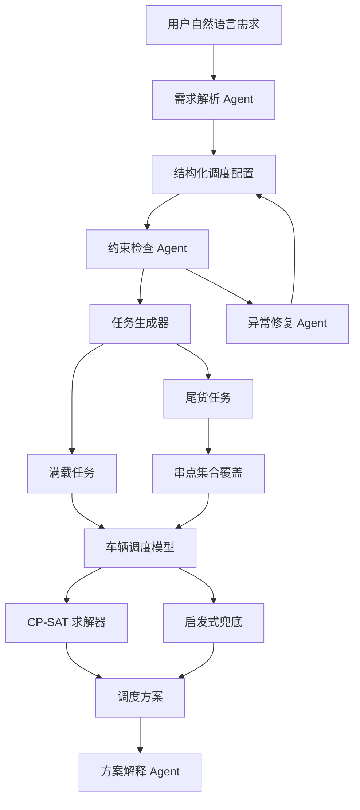

# LLM + 约束规划短途运输多智能体调度 Agent 技术报告

## 1. 项目目标

本项目基于数学建模论文《基于混合预测与约束规划的短途运输集成调度优化研究》，将其中的短途运输预测、任务生成、串点优化、车辆调度、容器决策和敏感性分析方法转化为可运行的软件系统。

目标交付物包括：

- 一个可发布到 GitHub 的 Python 工程仓库；
- 一个可端到端运行的调度 Agent MVP；
- 一份说明模型、架构、算法和后续扩展路径的技术报告。

系统采用“LLM 负责理解需求，优化器负责可验证求解”的设计。LLM 不直接决定调度结果，而是把自然语言需求转成结构化配置；真正的车辆分配、时间窗、容量和串点约束交给 CP-SAT 或启发式算法处理。

## 2. 论文模型到工程模块的映射

| 论文部分 | 工程模块 | 说明 |
| --- | --- | --- |
| 问题一：货量预测与 10 分钟拆解 | `Instance.forecast` 输入层 | 当前 MVP 接收预测结果，不重新训练 LSTM-MLP |
| 问题二：满载任务、尾货串点、车辆分配 | `task_generation.py` + `cpsat.py` | 先生成任务，再执行集合覆盖/车辆调度 |
| 问题三：标准容器内生决策 | `ProblemConfig.allow_container` + `use_container` | 容器影响容量和装卸时长 |
| 问题四：预测偏差敏感性分析 | 后续 `simulation` 模块 | 计划支持总量偏差与时间漂移场景 |
| 方案解释与重点线路展示 | `ExplanationAgent` | 对用户解释发运时间、车辆、容器、KPI |

## 3. 总体架构



## 4. 多 Agent 设计

### 4.1 需求解析 Agent

输入为中文自然语言，例如：

> 请基于 2024-12-16 的预测货量生成短途运输调度方案。车辆容量为 1000，允许使用标准容器，容器容量 800。优化目标需要平衡总成本、自有车周转率和车辆填充率。

输出为：

- 目标日期；
- 重点线路；
- 车辆容量、容器容量；
- 是否允许使用容器；
- 多目标权重；
- 硬约束和软偏好。

当前实现支持两条路径：

- 若存在 `OPENAI_API_KEY`，尝试调用 LLM 输出 JSON；
- 否则使用规则解析器，保证本地可运行。

### 4.2 约束检查 Agent

负责验证：

- 线路 ID 是否重复；
- 线路引用的车队是否存在；
- 预测货量是否为负；
- 时间窗是否合法；
- 容器容量是否超过车辆容量；
- 串点数量是否超过上限。

### 4.3 求解器调用 Agent

负责选择求解路径：

- 优先使用 OR-Tools CP-SAT；
- 未安装 OR-Tools 时，使用启发式调度器兜底；
- 输出统一的 `ScheduleSolution`，便于上层解释和导出。

### 4.4 方案解释 Agent

将求解结果转成面向业务的中文说明，包含：

- 求解状态；
- 任务数与分配数；
- 自有车任务与外部承运任务；
- 总成本、自有车周转率、装载率；
- 重点线路发运时间、车辆、货量、容器使用情况。

### 4.5 异常修复 Agent

MVP 中先实现保守修复：

- 对输入硬错误不自动篡改数据；
- 若禁止外部承运导致潜在不可行，可建议或启用外部承运兜底；
- 后续可加入自动放松时间窗、拆分超容量任务、改用外部承运等策略。

## 5. 任务生成模型

对每条线路按 10 分钟预测货量排序并累积：

- 当累计货量达到 `VEHICLE_CAPACITY = 1000`，生成满载任务；
- 任务最早发运时间为达到容量的时间点；
- 最晚发运时间为线路发运节点；
- 窗口结束仍未满载的货量形成尾货任务。

尾货串点遵循论文约束：

- 同一始发场地；
- 同一发运波次；
- 目的地数量不超过 3；
- 总货量不超过车辆容量；
- 组合后的最早时间不晚于最晚时间。

若安装 OR-Tools，小规模尾货组可用集合覆盖求解；否则使用贪心合并策略，按容量利用率尽量拼满。

## 6. CP-SAT 调度模型

### 6.1 决策变量

对每个任务 `i`：

- `start_i`：任务发运时间；
- `duration_i`：车辆占用时长；
- `use_container_i`：是否使用标准容器；
- `external_i`：是否外部承运；
- `assign_i_v`：任务是否分配给自有车辆 `v`。

对每辆自有车 `v`：

- `vehicle_used_v`：是否被使用；
- 可选 interval：用于 `NoOverlap` 防止同车任务时间冲突。

### 6.2 关键约束

- 每个任务必须由一辆自有车或外部承运完成；
- 发运时间满足任务时间窗；
- 同一自有车上的任务区间不得重叠；
- 容器任务货量不得超过容器容量；
- 外部承运任务不得使用容器；
- 容器会缩短装卸时间，从而改变车辆占用时长。

### 6.3 目标函数

采用论文中的加权多目标思想：

```text
minimize
  w_cost * total_cost
  - w_turnover * own_task_count
  + w_fill * unused_capacity
```

其中：

- `total_cost` 包括自有车固定成本、自有车变动成本、外部承运成本；
- `own_task_count` 作为自有车周转率的代理项；
- `unused_capacity` 用于鼓励更高装载率。

## 7. 当前 MVP 运行结果

在 `examples/sample_instance.json` 上，当前环境未安装 OR-Tools，因此系统自动使用启发式求解器。端到端烟测可以得到：

- 求解状态：`FEASIBLE`
- 运输任务数：9
- 已分配任务数：9
- 外部承运任务数：0
- 可解释输出包含两条重点线路的发运时间、车辆、货量和容器使用情况。

这证明工程链路已经打通：自然语言需求 → 结构化约束 → 任务生成 → 求解 → KPI → 解释。

## 8. GitHub 交付计划

### 8.1 第一阶段：MVP 仓库

- 完成当前 Python 包结构；
- 提供样例数据与自然语言请求；
- 提供 CLI；
- 提供烟测脚本和基础单元测试；
- 提供中文 README 与技术报告。

### 8.2 第二阶段：论文数据复现

- 将原始附件表转换为统一输入格式；
- 复现问题二和问题三的关键 KPI；
- 对比论文结果中的总成本、自有车周转率和重点线路调度表。

### 8.3 第三阶段：真实 LLM 接入

- 将需求解析 Prompt 固化为 JSON Schema；
- 增加解析结果校验和重试；
- 将模型调用日志、解析置信度和人工确认流程加入系统。

### 8.4 第四阶段：鲁棒性与可视化

- 实现预测总量偏差仿真；
- 实现时间漂移仿真；
- 输出 KPI 曲线、热力图和甘特图；
- 增加 Web API 和前端展示。

## 9. 风险与改进方向

- 当前样例是论文场景的简化数据，尚未直接读取全部附件；
- 启发式求解只能保证可行性，不保证全局最优；
- CP-SAT 目标函数仍需根据真实成本口径继续校准；
- 串点旅行时间目前采用简化估算；
- LLM 输出需要更强的 Schema 校验和安全边界。

## 10. 结论

本项目已经完成从论文模型到工程 MVP 的第一步转化。系统保留了论文的核心方法：预测货量转运输任务、尾货串点、约束规划车辆调度、容器决策和多目标优化。同时采用多 Agent 架构，把自然语言理解、约束校验、可验证求解、方案解释和异常修复拆分为清晰模块，为后续扩展到真实数据、GitHub 发布和完整技术报告奠定了基础。
